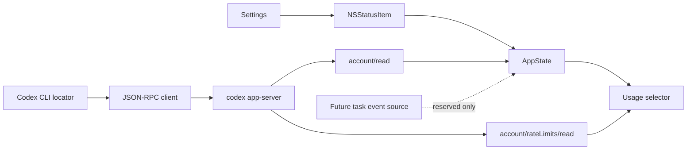

# CodexMenuMeter 实施计划

> 文档版本：v2.0
> 更新日期：2026-08-07
> 当前交付物：`menu_meter/CodexMenuMeter`

## 1. 产品定位

CodexMenuMeter 是独立原生 macOS 菜单栏伴随应用。它使用 Codex 官方 CLI 的 app-server 读取**账户额度**，以紧凑形式显示剩余百分比。

默认菜单栏结构：

```text
69%
```

用户可在设置中开启任务状态点预留位：

```text
●  69%
```

该状态点目前固定为灰色，表示“任务状态源尚未接入”，不表示任何任务正在运行、已完成或失败。

## 2. 已确认的产品边界

### 已实现

- 独立 `NSStatusItem`，无 Dock 图标；
- `5h` 窗口优先、缺失时回退一周窗口；
- 根据 `remaining = round(100 - usedPercent)` 显示整数百分比；
- 未登录、无有效窗口、连接失败或数据过期时显示 `--%`；
- 原生菜单：额度类型、重置时间、更新时间、打开 Codex、刷新、设置、退出；
- 60 秒兜底刷新、睡眠唤醒后刷新、手动刷新；
- 设置项：CLI 路径、周期标签、任务状态点预留、随 Codex/ChatGPT 启动；
- 自有应用图标、浅色/深色模式、动态无障碍标签；
- 仅使用公开 CLI/app-server，不读取令牌、不修改 Codex.app。

### 明确不实现（当前版本）

- 不监控官方 Codex/ChatGPT 桌面应用中已存在的任务；
- 不在下拉菜单展示运行任务、任务名称、运行时长、审批原因或任务日志；
- 不抓取屏幕、通知、私有数据库、进程内存或未公开 Web API；
- 不自动批准命令、文件变更、权限或用户输入。

## 3. 额度协议基线

已在本机 Codex CLI `0.147.0-alpha.1.2` 上验证 app-server 调用序列：

```text
JSON-RPC 2.0 + JSONL
initialize
initialized
account/read
account/rateLimits/read
```

实现约束：

- 请求和通知必须带 `jsonrpc: "2.0"`；
- 传输为一行一个 JSON 消息，不使用 `Content-Length` framing；
- `account/read.requiresOpenaiAuth == true` 不代表已登出；仅在 `account == nil` 时视为未登录；
- `resetsAt` 是 Unix 秒级时间戳；
- `primary` 不代表固定的 5 小时窗口，必须依 `windowDurationMins` 分类；
- 5 小时识别范围为 `240...360` 分钟；一周为 `9000...11000` 分钟；
- 读取失败不得保留或伪造旧百分比。

详细结构与安全约束见 [协议说明](CodexMenuMeter/docs/PROTOCOL.md)。

## 4. 当前 UX 规则

### 菜单栏

- 默认仅显示额度百分比，例如 `69%`、`--%`；
- “菜单栏显示额度周期标签”开启后显示 `5h 69%` 或 `7d 69%`；
- “显示任务状态点”默认关闭；
- 开启预留点后，圆点显示系统灰色；颜色未来仅在可靠任务状态源可用时启用；
- 不使用 Codex 商标图标作为菜单栏元素。

### 下拉菜单

```text
Codex 额度
────────────────
额度：一周剩余 69%
重置：2026/8/7 22:30
更新：刚刚
────────────────
打开 Codex
刷新
────────────────
设置…
退出 CodexMenuMeter
```

菜单不显示任务状态、运行任务或“状态源不可用”等任务文案，避免将未实现能力暴露为产品功能。

## 5. 架构



核心模块：

| 模块 | 职责 |
| --- | --- |
| `AppState` | 单向状态、刷新、过期处理、显示模型 |
| `JSONRPCClient` | 启动 app-server、JSONL 编解码、请求 ID、超时、关闭 |
| `RateLimitModels` | 账户确认、窗口分类、选择与百分比计算 |
| `StatusItemView` | 可选灰色点与百分比的紧凑布局 |
| `StatusItemController` | 菜单构建、无障碍标签、刷新和打开 Codex |
| `SettingsController` | 用户偏好与登录启动控制 |

## 6. 验收与测试

### 额度功能

- app-server 返回 300 + 10080 分钟窗口时选择 300 分钟；
- 只返回 10080 分钟窗口时正常显示一周额度；
- `usedPercent = 31` 时显示 `69%`；
- `account` 存在且 `requiresOpenaiAuth = true` 时视为已登录；
- 无窗口、未登录、超时、无 CLI 时显示 `--%`；
- JSONL 分片和未知通知不导致请求响应串线；
- 手动刷新、60 秒刷新、唤醒刷新不改变有效选择规则。

### UI 功能

- 默认不显示任务状态点；
- 设置开启后显示灰点，关闭后百分比布局无残余间距；
- 下拉菜单不含任务标题、数量、阶段、审批信息；
- `0%`、`9%`、`69%`、`100%`、`--%` 不截断；
- VoiceOver 在状态点关闭时不朗读任务状态；
- 菜单栏高亮态、深色模式和高对比度下可读。

完整测试命令、工具链限制与手工检查见 [测试指南](CodexMenuMeter/docs/TESTING.md)。

## 7. 任务状态 TODO（不进入当前发布范围）

只有在完成下列可行性验证后，才允许将灰色预留点映射为黄、绿、红：

- [ ] 证实存在公开、稳定、只读的方式订阅**官方桌面应用现有会话**；
- [ ] 验证该方式能接收 `turn/started`、成功/失败/中断完成、审批和阻塞输入；
- [ ] 验证连接不会干扰官方桌面应用，不要求读取令牌或修改其包内容；
- [ ] 对 Codex 更新、断线、睡眠唤醒和账户切换建立回归 fixture；
- [ ] 证明任务 ID、标题和终态可稳定去重，且不会泄露 prompt、命令、路径、diff 或凭据；
- [ ] 增加用户可见的数据源说明、隐私模式和“状态不可用”降级；
- [ ] 仅在上述项全部通过后，恢复任务菜单、任务列表与颜色语义。

替代路径是“由 CodexMenuMeter 启动并托管任务”。它只能监控自身创建的任务，需要独立的任务创建、审批、输入和恢复 UI；详见 [任务状态路线图](CodexMenuMeter/docs/TASK_STATUS.md)。

## 8. 发行清单

- [ ] `swift test` 通过；
- [ ] Release 构建、ad-hoc/Developer ID 签名验证；
- [ ] 检查实际 app-server 响应及 5h/7d 选择；
- [ ] 验证应用图标、无 Dock 图标、菜单栏布局；
- [ ] 验证设置变更即时刷新；
- [ ] 记录当前 CLI 版本、已知限制和变更日志。
