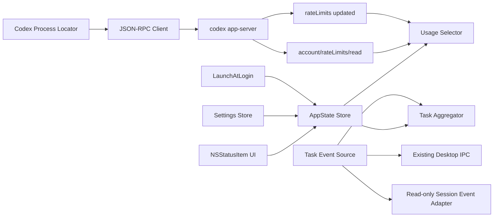

# Codex macOS 菜单栏额度与任务状态指示器实施计划

> 文档用途：供开发 Agent 直接执行  
> 文档版本：v1.1  
> 编写日期：2026-08-06  
> 建议项目名：`CodexMenuMeter`

---

## 1. 项目目标

在 macOS 顶部菜单栏中提供一个轻量、常驻、符合 macOS 设计习惯的 Codex 状态项，紧凑展示：

1. Codex 图标；
2. 当前应关注的剩余额度百分比；
3. 图标前方的任务状态圆点；
4. 点击状态项后，在展开菜单中列出当前正在运行的任务。

菜单栏默认视觉结构：

```text
●  [Codex 图标]  84%
```

额度展示规则：

- 当前账户存在 5 小时额度窗口时，展示 5 小时额度的剩余百分比；
- 当前账户没有 5 小时额度窗口时，展示一周额度的剩余百分比；
- 不得固定假设 `primary` 一定代表 5 小时额度，应按服务端返回的 `windowDurationMins` 识别额度窗口；
- 无法获取额度、数据过期或账户未登录时，展示 `--%`，不得伪造或沿用过期数据。

任务状态圆点规则：

| 状态 | 颜色 | 含义 |
|---|---|---|
| 运行中 | 系统黄色 | 至少一个 Codex 任务正在执行 |
| 已完成 | 系统绿色 | 最近一轮已成功完成，当前没有运行中或待介入任务 |
| 需要人介入 | 系统红色 | 等待授权、等待用户输入、任务失败或发生必须处理的阻塞 |
| 未连接/未知 | 系统灰色 | 尚未观察到任务、Codex 未运行、状态源不可用或状态已过期 |

全局状态优先级：

```text
红色 > 黄色 > 绿色 > 灰色
```

---

## 2. 首要技术结论

### 2.1 推荐交付形态

优先实现为一个独立的原生 macOS 菜单栏伴随应用，而不是修改、注入或重新签名官方 Codex.app。

原因：

- macOS 不提供让第三方应用直接修改另一个应用菜单栏状态项内容的公开接口；
- 修改 Codex.app 包内容会破坏签名、自动更新和可维护性；
- 独立应用可以使用公开的 `NSStatusItem`、SwiftUI 和 Codex app-server 接口；
- 用户可按住 Command 拖动菜单栏项目，将本应用放到 Codex 菜单栏图标旁边。

**产品语义：**“显示在 Codex 图标边上”在独立应用方案中表示创建一个可由用户排列到 Codex 图标旁的菜单栏状态项，而不是修改 Codex 原有状态项本身。

### 2.2 不允许采用的默认方案

除非用户明确授权且没有其他可行方案，不要：

- 修改 `/Applications/Codex.app` 内文件；
- 解包并改写 Electron `asar`；
- 绕过或破坏代码签名；
- 从 Keychain、`auth.json` 或进程内存直接提取登录令牌；
- 调用未公开的 ChatGPT 私有 HTTP 接口；
- 使用 Accessibility API 抓取 Codex 界面文字作为主要数据源；
- 读取其他应用的系统通知内容；
- 以高频轮询、截图或 OCR 方式判断任务状态。

### 2.3 关键可行性关卡

额度读取已有官方 app-server 方法，可直接进入实现。

任务状态存在官方的 `turn/started`、`turn/completed`、审批请求及用户输入请求事件，但独立应用必须先验证能否订阅**当前 Codex 桌面应用正在使用的 app-server 会话**。

因此，开发必须从“Phase 0：状态源可行性验证”开始。若无法以受支持方式读取现有 Codex 桌面任务状态，不得发布一个会误报红、黄、绿状态的版本。

---

## 3. 交付范围

### 3.1 MVP 必须包含

- 原生 macOS 菜单栏状态项；
- Codex 模板图标、额度百分比、状态圆点；
- 5 小时额度优先、一周额度回退逻辑；
- 点击后显示原生菜单或小型 popover；
- 当前额度类型、剩余比例、重置时间、数据更新时间；
- 当前任务汇总状态和阻塞原因；
- 展开菜单动态列出当前正在运行的任务，包括任务名称、状态、运行时长和可用操作；
- 自动刷新、睡眠唤醒后刷新、断线重连；
- 开机启动选项；
- 浅色/深色模式；
- VoiceOver 和键盘可访问性；
- 单元测试、集成测试和安装说明。

### 3.2 MVP 不包含

- 修改 OpenAI 服务端额度；
- 购买额度或消耗 reset credit；
- 在菜单栏中展示逐任务完整日志；
- 同时监控远程 Codex Web、其他 Mac 或其他账户；
- 通过非公开接口控制 Codex 桌面应用；
- App Store 上架；
- 自动替换官方 Codex 菜单栏图标。

### 3.3 可选增强

- 菜单栏显示周期标签：`5h 84%` 或 `7d 84%`；
- 低额度阈值通知；
- 完整任务历史列表与搜索；
- 点击任务打开对应 Codex thread（若 Codex 提供稳定的 deep link 或受支持的定位接口）；
- 显示下次重置倒计时；
- Spark、月度额度或 credits 的独立展示；
- Sparkle 自动更新；
- 多账户支持。

---

## 4. 用户体验与视觉规范

## 4.1 菜单栏状态项

推荐使用 AppKit `NSStatusItem`，并在其 `NSStatusBarButton` 内绘制组合内容，而不是仅使用纯 SwiftUI `MenuBarExtra`。

原因：

- 需要精确控制“圆点 + 图标 + 百分比”的水平布局；
- 需要动态改变文字和无障碍标签；
- 需要更可靠地处理模板图标、状态宽度和系统高亮态；
- 后续可平滑支持 popover 或原生菜单。

建议尺寸：

- 状态项高度：由系统菜单栏决定；
- Codex 图标绘制框：16 × 16 pt；
- 圆点直径：6 pt；
- 圆点与图标间距：4 pt；
- 图标与百分比间距：4 pt；
- 百分比使用系统菜单栏字号，不自定义固定字体；
- 百分比只显示整数，范围 `0%...100%`；
- 未知值显示 `--%`。

不要：

- 使用大面积自定义背景；
- 使用渐变、阴影、描边或动画闪烁；
- 用 emoji 代替状态圆点；
- 强制设置不适配高对比度模式的颜色；
- 在菜单栏主状态项中显示过长文本。

## 4.2 图标

- 使用单色模板图标，设置 `isTemplate = true`；
- 优先使用官方允许使用的 Codex 图形资源；
- 若缺少可合法分发的 Codex 菜单栏图形，使用项目自有的抽象代码代理图标，并在 README 中说明；
- 提供 1x、2x、3x PDF/vector 或 Asset Catalog；
- 图标在浅色、深色、增加对比度模式下均应清晰；
- 不在菜单栏主图标中烘焙黄色、绿色、红色，颜色只用于前方圆点。

## 4.3 状态颜色

使用语义系统颜色：

```swift
NSColor.systemYellow
NSColor.systemGreen
NSColor.systemRed
NSColor.systemGray
```

不要硬编码 RGB 值。

圆点必须同时有文本语义，不能只依赖颜色：

- 黄色：VoiceOver 读作“Codex 正在运行”；
- 绿色：VoiceOver 读作“Codex 已完成”；
- 红色：VoiceOver 读作“Codex 需要处理”；
- 灰色：VoiceOver 读作“Codex 状态未知”。

## 4.4 点击后的菜单或 Popover

首版推荐原生 `NSMenu`，减少视觉和交互复杂度。

菜单结构：

```text
Codex 状态
────────────────────────
● 正在运行 · 2 个任务
额度：5 小时剩余 84%
重置：今天 22:30
更新：刚刚
────────────────────────
正在运行的任务（2）
● 修复登录页面              01:42
  正在执行命令
● 补充额度窗口测试          00:18
  正在分析
────────────────────────
打开 Codex
刷新
────────────────────────
登录时启动                    ✓
设置…
退出 CodexMenuMeter
```

任务需要人介入时，该任务继续保留在任务列表中，并使用红色圆点和明确文字：

```text
正在运行的任务（2）
● 修复登录页面              等待授权
  需要批准命令执行
● 补充额度窗口测试          00:18
  正在分析
```

任务列表规则：

- 列出所有尚未进入终态的任务，包括执行中、等待授权和等待用户输入；
- 默认最多直接显示 5 个任务，超过时在底部显示“查看其余 N 个任务…”；
- 排序优先级为：需要人介入 > 正在执行 > 最近更新时间；
- 每个任务主行显示任务名称和运行时长或阻塞状态，次行显示简短阶段说明；
- 点击任务行：若存在受支持的 thread 定位能力则打开对应 Codex 任务，否则仅打开 Codex 主界面；
- 不提供稳定定位能力时，不得伪造 deep link；
- 任务列表发生变化时原地刷新，不自动弹出菜单，也不抢占键盘焦点；
- 展开菜单期间保持用户当前高亮项，避免刷新导致选择跳动；
- 当前没有运行中任务时显示不可点击项“当前没有运行中的任务”；
- 任务名称不得直接使用完整 prompt。优先使用 Codex 提供的 thread title/summary；没有标题时显示“未命名任务 · <短 ID>”。

红色状态时，菜单顶部同时增加聚合提示：

```text
需要处理：1 个任务等待授权
```

无数据时显示：

```text
额度：暂不可用
正在运行的任务：状态源不可用
原因：未找到 Codex CLI / 尚未登录 / 连接中断
```

---

## 5. 核心业务规则

## 5.1 额度数据模型

```swift
struct UsageWindow: Equatable, Sendable {
    let kind: UsageWindowKind
    let usedPercent: Double
    let remainingPercent: Int
    let durationMinutes: Int
    let resetsAt: Date?
    let receivedAt: Date
}

enum UsageWindowKind: String, Sendable {
    case fiveHour
    case weekly
    case monthly
    case unknown
}
```

计算规则：

```text
remainingPercent = round(clamp(100 - usedPercent, 0, 100))
```

不得直接把 `usedPercent` 当成剩余额度。

## 5.2 额度窗口识别

不要依赖 `primary`/`secondary` 的字段位置，应遍历所有可用窗口并根据时长分类。

建议容差：

```text
5 小时窗口：240...360 分钟
一周窗口：9000...11000 分钟
月度窗口：38000...50000 分钟（仅识别，不进入 MVP 主显示）
```

精确值通常可能是：

```text
5 小时：300 分钟
一周：10080 分钟
```

选择算法：

```swift
func selectDisplayedWindow(_ windows: [UsageWindow]) -> UsageWindow? {
    if let fiveHour = windows.first(where: { $0.kind == .fiveHour }) {
        return fiveHour
    }
    if let weekly = windows.first(where: { $0.kind == .weekly }) {
        return weekly
    }
    return nil
}
```

### 重要边界情况

- 只有 `primary`，且时长是 10080：显示一周额度；
- `primary` 为一周、`secondary` 为 null：正常回退，不报错；
- 5 小时窗口短暂消失：切换到一周额度；
- 5 小时窗口恢复：下一次有效更新后自动切回；
- `usedPercent` 缺失、NaN 或超范围：丢弃该窗口；
- 收到 sparse update：与最后一次完整 snapshot 合并，不能用 null 清除已有有效值；
- 账户切换：立即清空旧账户缓存，先显示 `--%`；
- 数据超过 5 分钟未刷新：标记 stale，菜单栏显示 `--%`。

## 5.3 任务状态模型

```swift
enum AgentActivityState: Equatable, Sendable {
    case unknown
    case running(activeCount: Int)
    case completed(completedAt: Date)
    case needsAttention(reason: AttentionReason)
}

enum AttentionReason: Equatable, Sendable {
    case commandApproval
    case fileChangeApproval
    case permissionApproval
    case userInput
    case authentication
    case failed(message: String?)
    case systemError(message: String?)
}
```

### 状态映射

| Codex 事件/状态 | 本应用状态 |
|---|---|
| `turn/started`, `turn.status = inProgress` | 黄色 |
| `thread.status = active` | 黄色 |
| `turn/completed` 且 `status = completed` | 绿色 |
| `turn/completed` 且 `status = interrupted` | 灰色；菜单中注明已中断 |
| `turn/completed` 且 `status = failed` | 红色 |
| `applyPatchApproval` | 红色 |
| `execCommandApproval` | 红色 |
| `item/permissions/requestApproval` | 红色 |
| `item/tool/requestUserInput` 且 `isBlocking = true` | 红色 |
| `thread.status = systemError` | 红色 |
| 状态源断开或数据过期 | 灰色 |

### 多任务聚合

```swift
func aggregate(_ tasks: [TaskState]) -> AgentActivityState {
    if let attention = tasks.first(where: { $0.needsAttention }) {
        return .needsAttention(reason: attention.reason)
    }
    let activeCount = tasks.filter(\.isRunning).count
    if activeCount > 0 {
        return .running(activeCount: activeCount)
    }
    if let latest = tasks.compactMap(\.completedAt).max() {
        return .completed(completedAt: latest)
    }
    return .unknown
}
```

### 绿色状态保留规则

- 当前无红色、黄色状态时，保留最近一次成功完成的绿色状态；
- 新任务开始后立即切换黄色；
- 应用重启后，只在能够确认最近任务已成功完成时恢复绿色；
- 如果无法确认历史状态，显示灰色而不是猜测为绿色。

## 5.4 正在运行任务列表模型

```swift
struct RunningTaskSummary: Identifiable, Equatable, Sendable {
    let id: String
    let threadID: String?
    let displayTitle: String
    let phase: RunningTaskPhase
    let startedAt: Date?
    let updatedAt: Date
    let attentionReason: AttentionReason?
    let openTarget: TaskOpenTarget?
}

enum RunningTaskPhase: Equatable, Sendable {
    case queued
    case analyzing
    case executing
    case waitingForApproval
    case waitingForUserInput
    case reconnecting
}

enum TaskOpenTarget: Equatable, Sendable {
    case codexThread(URL)
    case codexApplication
}
```

任务进入列表的条件：

```text
turn/thread 尚未进入 completed、failed、interrupted 或 cancelled 终态
```

任务退出列表的条件：

- 收到明确的成功、失败、中断或取消终态；
- 收到 thread 删除/归档事件，并可确认其不再运行；
- 状态源断线时不要立即删除，先标记为“正在重新连接”；
- 断线超过状态过期阈值后清空列表，并显示“状态源不可用”，不得继续显示为运行中。

标题生成优先级：

1. 协议提供的 thread title；
2. 协议提供的脱敏 task summary；
3. 工具/阶段名称，例如“运行测试”；
4. `未命名任务 · <threadID 后 6 位>`；
5. 无稳定任务 ID 时显示“未命名任务”。

不得使用以下内容生成标题：

- 完整用户 prompt；
- 命令参数、命令输出；
- 完整仓库路径或文件路径；
- diff 内容、密钥、令牌或环境变量。

运行时长计算：

```text
elapsed = now - startedAt
```

- 小于 1 小时显示 `mm:ss`；
- 1 小时及以上显示 `h:mm`；
- 缺少开始时间时显示阶段文字，不显示伪造时长；
- 等待介入时优先显示“等待授权”或“等待输入”，不显示不断增长的等待时长作为主信息。

---

## 6. 数据源与集成方案

## 6.1 额度数据源：Codex app-server

通过 Codex 官方 app-server 的 JSON-RPC 接口读取：

```json
{"method":"account/rateLimits/read","id":7}
```

监听：

```text
account/rateLimits/updated
account/updated
```

使用返回字段：

```text
rateLimits.primary.usedPercent
rateLimits.primary.windowDurationMins
rateLimits.primary.resetsAt
rateLimits.secondary.usedPercent
rateLimits.secondary.windowDurationMins
rateLimits.secondary.resetsAt
rateLimitReachedType
planType
```

实现要求：

1. 首次连接后调用 `initialize`；
2. 调用 `account/read` 确认登录状态；
3. 调用 `account/rateLimits/read` 获取完整 snapshot；
4. 监听 `account/rateLimits/updated`；
5. sparse update 与缓存 snapshot 合并；
6. app-server 重启后重新初始化并全量读取；
7. 严禁在日志中输出账户令牌、完整邮箱或原始认证对象。

## 6.2 app-server 可执行文件发现

按以下顺序发现：

1. 用户设置中明确指定的 `codex` 可执行文件；
2. Codex.app bundle 内官方附带的 CLI/app-server；
3. 当前 shell 环境中的 `which codex`；
4. 常见 Homebrew/npm 安装路径；
5. 都不可用时显示安装指引，不自动下载未知二进制。

发现后执行：

```bash
codex app-server
```

若当前版本只提供实验 MCP server，则仅作为兼容备选：

```bash
codex mcp-server
```

优先 app-server，不把实验接口作为长期唯一依赖。

## 6.3 任务状态数据源：分级方案

### Level A：连接现有 Codex 桌面 app-server（首选）

Phase 0 验证以下内容：

- Codex 桌面进程是否暴露本地 socket、named pipe、Mach service 或可复用 stdio bridge；
- 是否存在受支持的订阅方式；
- 能否接收 `thread/status/changed`、`turn/started`、`turn/completed` 和审批请求；
- 连接是否不影响官方 Codex 客户端；
- Codex 更新后接口是否可发现和降级。

仅当以上验证通过，才将该方式作为正式任务状态源。

### Level B：伴随应用作为 app-server 客户端

该方式可以可靠读取由本应用连接的 app-server 内发生的任务，但不一定能观察官方 Codex 桌面应用中已经运行的任务。

只允许在产品明确改为“通过 CodexMenuMeter 启动/托管任务”时采用。不得把它描述成能够自动监控所有 Codex 桌面任务。

### Level C：只读本地事件文件或日志（可选降级）

可使用 FSEvents 只读监听 Codex 官方生成的 session rollout JSONL 或日志，识别：

- turn 开始；
- turn 完成；
- turn 失败；
- 明确写入文件的阻塞请求。

限制：

- 必须使用公开、稳定或至少可检测版本的结构；
- 解析器要有 fixture 测试和版本兼容层；
- 日志缺失或结构变化时立即降级为灰色；
- 不允许从“长时间没有新日志”推断为完成；
- 若无法可靠识别待授权/待输入，不得显示红色。

### Level D：不可行时的产品降级

若 Phase 0 证明无法可靠观察现有 Codex 桌面任务：

- 仍可交付“额度菜单栏显示器”；
- 任务圆点固定为灰色，并在设置中标注“桌面任务状态暂不可用”；
- 或停止发布，转为向 Codex 官方代码库提交 feature request/PR；
- 不得通过屏幕抓取、私有通知数据库或破坏签名等方式强行实现。

---

## 7. 系统架构



### 模块划分

```text
CodexMenuMeter/
├── App/
│   ├── CodexMenuMeterApp.swift
│   ├── AppDelegate.swift
│   └── AppEnvironment.swift
├── MenuBar/
│   ├── StatusItemController.swift
│   ├── StatusItemView.swift
│   ├── StatusMenuBuilder.swift
│   ├── RunningTaskMenuItemView.swift
│   └── StatusIconRenderer.swift
├── Domain/
│   ├── UsageWindow.swift
│   ├── AgentActivityState.swift
│   ├── DisplayState.swift
│   └── StateReducer.swift
├── CodexRPC/
│   ├── CodexProcessLocator.swift
│   ├── CodexAppServerProcess.swift
│   ├── JSONRPCClient.swift
│   ├── CodexProtocolModels.swift
│   ├── RateLimitService.swift
│   └── AccountService.swift
├── TaskObservation/
│   ├── TaskEventSource.swift
│   ├── DesktopIPCEventSource.swift
│   ├── RolloutEventSource.swift
│   ├── TaskStateStore.swift
│   ├── RunningTaskPresenter.swift
│   └── EventCompatibility.swift
├── Infrastructure/
│   ├── Logger.swift
│   ├── RetryPolicy.swift
│   ├── ReachabilityMonitor.swift
│   ├── SleepWakeMonitor.swift
│   └── LaunchAtLoginService.swift
├── Settings/
│   ├── SettingsView.swift
│   └── UserPreferences.swift
├── Resources/
│   ├── Assets.xcassets
│   └── Localizable.xcstrings
└── Tests/
    ├── UsageSelectorTests.swift
    ├── RateLimitMergeTests.swift
    ├── TaskAggregatorTests.swift
    ├── JSONRPCClientTests.swift
    ├── FixtureParsingTests.swift
    └── StatusItemSnapshotTests.swift
```

---

## 8. 状态管理

采用单向数据流，UI 不直接读 RPC 或日志。

```swift
@MainActor
final class AppState: ObservableObject {
    @Published private(set) var usage: UsageDisplayState = .loading
    @Published private(set) var activity: AgentActivityState = .unknown
    @Published private(set) var runningTasks: [RunningTaskSummary] = []
    @Published private(set) var connection: ConnectionState = .disconnected
    @Published private(set) var lastUpdatedAt: Date?
}
```

显示模型：

```swift
struct MenuBarDisplayState: Equatable {
    let percentageText: String
    let quotaKindText: String
    let dotColor: NSColor
    let accessibilityLabel: String
    let tooltip: String
}
```

示例无障碍标签：

```text
Codex，正在运行，5 小时额度剩余 84%，今天 22 点 30 分重置
```

---

## 9. 刷新、重连和缓存策略

### 9.1 刷新触发

- app-server 推送 `account/rateLimits/updated`：立即更新；
- 应用启动：立即全量读取；
- 手动点击“刷新”：立即全量读取；
- macOS 从睡眠唤醒：延迟 1 秒后全量读取；
- 网络恢复：延迟 2 秒后全量读取；
- 后台兜底轮询：60 秒；
- 数据接近重置时间：重置后 2 秒执行全量读取。

### 9.2 重连

指数退避：

```text
1s → 2s → 5s → 10s → 30s → 60s
```

最大间隔 60 秒；用户手动刷新时重置退避。

### 9.3 缓存

- 内存中保存最近完整 snapshot；
- 可在 `Application Support` 保存最后一次非敏感显示值；
- 磁盘缓存不得包含 access token、refresh token、完整账户对象或任务正文；
- 应用重新启动时可短暂显示缓存，但必须标注 stale，并在 5 秒内尝试刷新；
- 超过 5 分钟仍未刷新则显示 `--%`。

---

## 10. 隐私与安全

- 所有数据默认只在本机处理；
- 不增加遥测，除非另行明确设计并让用户选择加入；
- 日志使用 `OSLog` privacy 标记；
- 邮箱默认只显示脱敏形式，例如 `u***@example.com`；
- 不记录 prompt、agent 回复、命令输出、文件 diff 或仓库路径；
- 仅读取完成状态所需的最小事件字段；
- 子进程环境变量必须过滤敏感变量；
- 退出时终止由本应用启动的 app-server 子进程；
- 不终止、暂停或修改 Codex 官方桌面进程；
- 不自动批准任何命令、文件修改或权限请求。

---

## 11. 实施阶段

## Phase 0：可行性验证与基线记录

目标：确认数据源，形成 go/no-go 结论。

任务：

1. 记录测试机 macOS、Codex App、Codex CLI 版本；
2. 验证 `codex app-server` 能否启动并完成 initialize；
3. 验证 `account/read` 与 `account/rateLimits/read`；
4. 保存脱敏后的 5 小时 + 一周、只有一周、未登录、额度耗尽 fixture；
5. 检查运行中的 Codex 桌面进程、子进程、socket 和日志位置；
6. 判断是否存在受支持的现有桌面 app-server 订阅方式；
7. 启动一个真实测试任务，验证 yellow/green/red 对应事件；
8. 形成 `docs/feasibility.md`，明确任务状态采用 Level A、B、C 或 D；
9. 若任务状态不可可靠实现，按 Level D 处理，不进入误导性实现。

验收：

- 额度数据源可用；
- 5 小时缺失时能够识别一周窗口；
- 任务状态源有明确证据和限制；
- 无需读取令牌或修改 Codex.app。

## Phase 1：工程骨架与菜单栏 UI

1. 创建 Swift Package/Xcode macOS App；
2. 部署目标建议为 macOS 14 或更高；
3. 配置 `LSUIElement = true`，默认不显示 Dock 图标；
4. 建立 `NSStatusItem`；
5. 实现组合绘制：状态圆点、模板图标、百分比；
6. 实现原生菜单；
7. 实现“正在运行的任务”动态菜单分区和自定义任务行；
8. 支持任务名、阶段、运行时长、红/黄状态及最多 5 项折叠规则；
9. 实现浅色、深色、提高对比度和 VoiceOver；
10. 加入 mock data，先完成单任务、多任务、阻塞任务和无任务状态切换。

验收：

- 启动后 2 秒内出现菜单栏状态项；
- 黄色、绿色、红色、灰色清晰可辨；
- `0%`、`9%`、`84%`、`100%`、`--%` 不截断；
- 菜单栏高亮态正常；
- 展开菜单可显示 0、1、5 和超过 5 个任务的状态；
- 菜单刷新时不关闭菜单、不抢焦点、不跳动当前选择；
- 无 Dock 图标和多余主窗口。

## Phase 2：JSON-RPC 与额度读取

1. 实现 `Process` + stdin/stdout pipe；
2. 实现逐行 JSON-RPC 编解码；
3. 实现请求 ID、超时、取消、通知分发；
4. 接入 account/rateLimits；
5. 按 `windowDurationMins` 分类；
6. 实现剩余百分比计算；
7. 实现 sparse update 合并；
8. 实现刷新、stale 和错误状态；
9. 实现重置时间本地化。

验收：

- 有 5 小时时显示 5 小时；
- 无 5 小时时自动显示一周；
- `usedPercent = 16` 时显示 `84%`；
- 服务重启后可自动恢复；
- 账户切换不短暂显示旧账户数据。

## Phase 3：任务状态观察

根据 Phase 0 选择的状态源实现。

必做事件：

- turn start；
- turn completed；
- turn failed；
- command/file/permission approval；
- blocking user input；
- connection lost；
- multiple active turns；
- thread title/summary 更新；
- 任务进入终态后从运行列表移除。

实现聚合优先级：红 > 黄 > 绿 > 灰。

同时维护 `runningTasks` 列表：

- 收到 start/active 事件时创建或更新任务；
- 收到阶段变化时更新次级状态文字；
- 收到 approval/user input 时保留任务并标红；
- 收到终态事件时从列表移除，再更新全局圆点；
- 事件乱序时以服务端时间、序列号或 reducer 规则防止已完成任务重新出现；
- 多个事件指向同一 thread/turn 时必须去重。

验收：

- 任务开始 1 秒内变黄；
- 成功结束 1 秒内变绿；
- 出现授权或阻塞输入 1 秒内变红；
- 介入完成并恢复执行后从红变黄；
- 所有任务完成后变绿；
- 展开菜单在任务开始后 1 秒内新增对应任务；
- 任务完成、失败、中断或取消后 1 秒内从运行列表移除；
- 待授权任务保留在列表中并显示红点和阻塞原因；
- 并行任务不会重复、串名或错误复用时长；
- 状态源中断后不继续显示陈旧黄色或绿色；运行列表在过期后清空并显示状态不可用。

## Phase 4：设置、登录启动与可靠性

1. 使用 `SMAppService.mainApp` 实现登录启动；
2. 增加 Codex CLI 路径选择；
3. 增加额度周期标签开关；
4. 增加诊断页面，只显示脱敏信息；
5. 处理系统睡眠、唤醒、网络变化；
6. 添加优雅退出和子进程清理；
7. 加入崩溃恢复测试；
8. 完成 README、安装和卸载说明。

## Phase 5：打包与验收

1. Release 构建；
2. Hardened Runtime；
3. Developer ID 签名；
4. 公证 notarization；
5. 生成 DMG 或 ZIP；
6. 在干净账户和干净 Mac 用户下测试；
7. 检查 Codex 自动更新前后兼容性；
8. 输出 `CHANGELOG.md` 和已知限制。

---

## 12. 测试计划

## 12.1 单元测试

### 额度选择

| 输入 | 预期 |
|---|---|
| 300 分钟 + 10080 分钟 | 选择 300 分钟 |
| 只有 10080 分钟 | 选择 10080 分钟 |
| primary=10080, secondary=null | 选择一周 |
| 只有未知时长 | `nil` / `--%` |
| used=0 | 100% |
| used=100 | 0% |
| used=-1 或 101 | clamp 或拒绝，按实现约定测试 |

### sparse update

- 完整 snapshot 后收到只更新 primary 的通知；
- 通知中的 null 不清除缓存的非空账户元数据；
- 账户 ID/登录状态变化时清空旧 snapshot；
- 重置后窗口结构变化。

### 状态聚合

- 1 个运行中 → 黄；
- 1 个完成 → 绿；
- 运行中 + 待授权 → 红；
- 2 个运行中 + 1 个完成 → 黄；
- 全部完成 → 绿；
- 连接丢失 → 灰。

### 正在运行任务列表

- start 事件新增任务；
- 同一 thread/turn 的重复事件不产生重复行；
- 标题更新后保持同一任务 ID；
- approval 事件将对应行变为红色但不移除；
- completed/failed/interrupted/cancelled 事件移除对应行；
- 事件乱序不会让终态任务重新进入列表；
- 超过 5 个任务时排序和“其余 N 个”计数正确；
- 缺失标题、开始时间和 open target 时安全降级。

## 12.2 集成测试

- 启动 mock JSON-RPC server；
- 模拟分片 stdout；
- 模拟 malformed JSON；
- 模拟通知早于请求响应；
- 模拟 app-server 崩溃并重启；
- 模拟 Codex 未安装；
- 模拟未登录；
- 模拟五小时窗口动态消失；
- 模拟额度重置；
- 模拟审批请求和完成；
- 模拟多个 thread 并行；
- 模拟任务标题更新、重复事件和乱序终态；
- 模拟 6 个以上活动任务及菜单折叠；
- 模拟任务点击定位可用与不可用两种情况。

## 12.3 UI 测试

- 浅色/深色；
- 高对比度；
- Reduce Transparency；
- 中文和英文；
- 刘海屏及菜单栏空间不足；
- 多显示器；
- 菜单栏自动隐藏；
- VoiceOver；
- 任务名称超长、Emoji、中英文混排和无标题；
- 展开菜单期间任务持续更新；
- 200%/300% Retina 缩放。

## 12.4 性能目标

空闲状态目标：

- CPU 平均低于 1%；
- 内存建议低于 80 MB；
- 不持续写磁盘；
- 每分钟最多一次兜底额度轮询；
- 不因菜单栏刷新频繁触发布局抖动；
- Energy Impact 保持 Low。

---

## 13. 验收标准

### 功能验收

- [ ] 菜单栏显示“圆点 + Codex 图标 + 百分比”；
- [ ] 存在 5 小时窗口时显示其剩余百分比；
- [ ] 不存在 5 小时窗口时显示一周剩余百分比；
- [ ] 额度按 `100 - usedPercent` 计算；
- [ ] 运行中为黄色；
- [ ] 成功完成为绿色；
- [ ] 待授权、待输入、失败或系统错误为红色；
- [ ] 不可确认状态为灰色；
- [ ] 多任务遵循红 > 黄 > 绿 > 灰；
- [ ] 点击可查看额度类型、重置时间和状态原因；
- [ ] 展开菜单列出所有当前非终态任务；
- [ ] 每个任务显示名称、阶段以及运行时长或阻塞状态；
- [ ] 待介入任务在列表中显示红点和原因；
- [ ] 任务终止后及时从运行列表移除；
- [ ] 超过 5 个任务时显示折叠入口和剩余数量；
- [ ] 可定位任务时点击打开对应 Codex thread，不可定位时安全回退为打开 Codex；
- [ ] 可手动刷新并打开 Codex；
- [ ] 支持登录时启动。

### 设计验收

- [ ] 使用系统字体和系统语义颜色；
- [ ] 图标为模板图标；
- [ ] 支持浅色/深色和高对比度；
- [ ] 状态不只依赖颜色表达；
- [ ] 主状态项宽度紧凑；
- [ ] 不使用持续动画或闪烁；
- [ ] VoiceOver 标签完整；
- [ ] 任务列表可由键盘导航，任务状态不只依赖圆点颜色；
- [ ] 长任务名截断合理，并通过辅助文本或 tooltip 提供完整标题。

### 安全验收

- [ ] 不直接读取或导出认证令牌；
- [ ] 不调用私有 Web API；
- [ ] 不修改 Codex.app；
- [ ] 不自动批准任何操作；
- [ ] 日志和任务菜单中不包含完整 prompt、diff、命令输出、仓库路径或完整邮箱；
- [ ] app-server 异常时安全降级。

---

## 14. 已知风险与应对

| 风险 | 影响 | 应对 |
|---|---|---|
| Codex 额度窗口结构变化 | 可能错误选择额度 | 按时长分类，不依赖 primary/secondary；保留 unknown |
| 5 小时窗口暂时消失 | 菜单栏数据缺失 | 自动回退一周额度 |
| app-server 协议变化 | 无法读取数据 | 协议适配层、版本检测、fixture 回归 |
| 无法订阅现有桌面任务 | 无法可靠显示圆点状态 | Phase 0 gate；降级灰色或停止发布任务状态功能 |
| 本地日志格式变化 | 状态误判 | 版本化解析器；解析失败立即灰色 |
| Codex 和 companion 显示不一致 | 用户困惑 | 展示更新时间和数据源；手动刷新；不覆盖过期值 |
| 菜单栏空间不足 | 状态项被隐藏 | 保持紧凑；提供仅图标/隐藏百分比设置作为增强 |
| 活动任务过多 | 展开菜单过长、难以操作 | 默认显示 5 个；其余折叠；按介入优先排序 |
| 任务标题含敏感内容 | 菜单栏旁观泄露 | 只使用协议标题/脱敏摘要；禁止完整 prompt 和路径；提供隐私模式 |
| 任务事件乱序或重复 | 已完成任务重新出现或重复显示 | reducer 去重、终态防回滚、序列号/时间戳校验 |
| 应用签名与分发 | 安装警告 | Developer ID + notarization |
| 官方商标/图标授权 | 不能分发 Codex 图标 | 使用可授权资源或项目自有抽象图标 |

---

## 15. Agent 执行约束

Agent 执行本文档时必须遵守：

1. 先完成 Phase 0，不得跳过任务状态源验证；
2. 先提交可运行的最小 UI，再接真实数据；
3. 每个阶段均提供可复现测试；
4. 所有解析逻辑均使用脱敏 fixture；
5. 不使用“看起来能用”的私有接口作为默认生产方案；
6. 无法可靠确定状态时必须显示灰色；
7. 不得把轮询失败误判为任务完成；
8. 不得把普通失败自动归类为“已完成”；
9. 不得写入或修改用户 Codex 配置，除非设置页明确提示并由用户操作；
10. 不得自动安装依赖或修改系统安全设置；
11. 生成的每个 PR 应包含测试结果、已知限制和截图；
12. 任何偏离本文档的架构变更应先写入 ADR；
13. 正在运行任务列表只展示最小必要元数据，不得为了生成标题读取完整对话、命令输出或文件内容；
14. 无法可靠识别任务终态时，应清空或标记状态不可用，不得让“幽灵任务”长期留在菜单中。

建议 ADR：

```text
docs/adr/0001-companion-app-vs-codex-patch.md
docs/adr/0002-task-event-source.md
docs/adr/0003-rate-limit-window-classification.md
```

---

## 16. 建议提交顺序

```text
1. chore: create macOS menu bar project skeleton
2. feat: render compact status item with mock state
3. feat: add JSON-RPC transport and mock server tests
4. feat: read and classify Codex rate-limit windows
5. feat: add reconnect, stale handling, and reset refresh
6. docs: record task-status feasibility decision
7. feat: add selected task event source
8. feat: aggregate running, completed, and attention states
9. feat: show active tasks in the expanded status menu
10. feat: add native menu actions, settings, and launch at login
11. test: add integration and UI regression coverage
12. build: add signing, notarization, and release packaging
13. docs: finalize README, privacy, troubleshooting, limitations
```

---

## 17. 完成定义（Definition of Done）

项目只有在以下条件全部满足时才算完成：

- 菜单栏额度逻辑已用真实账户和 mock fixture 双重验证；
- 5 小时额度缺失场景已验证；
- 任务状态源已形成书面可行性结论；
- 黄色、绿色、红色状态均有真实事件验证或明确降级；
- 展开菜单能够实时显示并更新正在运行、等待授权和等待输入的任务；
- 任务进入终态后能够可靠移除，不存在重复任务或长期残留的幽灵任务；
- 任务标题和菜单内容通过隐私检查，不展示完整 prompt、输出、路径或密钥；
- 断线、重启、睡眠唤醒和账户切换均已测试；
- 没有敏感信息写入日志或磁盘缓存；
- 界面通过浅色、深色、高对比度和 VoiceOver 检查；
- Release 构建已签名并通过 Gatekeeper；
- README 中明确说明应用是独立 companion，不会修改官方 Codex.app；
- 已知限制中明确说明任务状态监控的覆盖范围。

---

## 18. 参考资料

- OpenAI Codex app-server README：  
  https://github.com/openai/codex/blob/main/codex-rs/app-server/README.md
- OpenAI Codex MCP interface：  
  https://github.com/openai/codex/blob/main/codex-rs/docs/codex_mcp_interface.md
- OpenAI Codex pricing and usage limits：  
  https://learn.chatgpt.com/docs/pricing
- Apple Human Interface Guidelines — Menu Bar：  
  https://developer.apple.com/design/human-interface-guidelines/the-menu-bar
- Apple SwiftUI MenuBarExtra：  
  https://developer.apple.com/documentation/swiftui/menubarextra
- Apple AppKit NSStatusBar：  
  https://developer.apple.com/documentation/appkit/nsstatusbar

